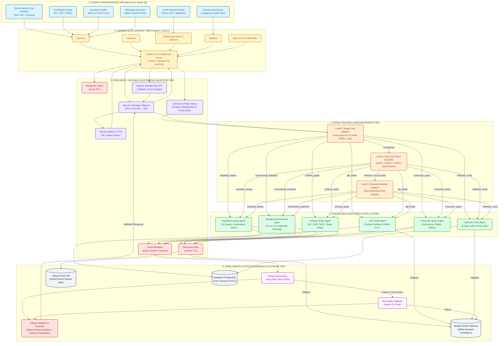
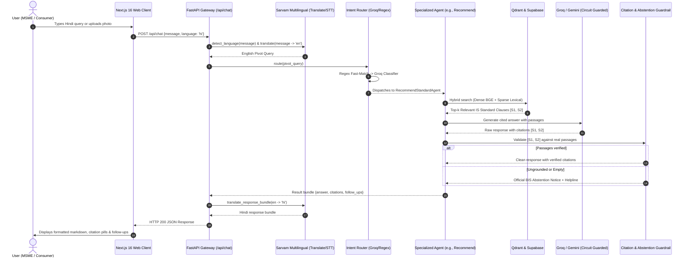

# Mithra: System Architecture Specification & Diagramming Guide
> **Bureau of Indian Standards (BIS) AI Assistant | Smart India Hackathon (SIH PS 26107)**  
> **Document Purpose:** Complete architectural blueprints, component specifications, interaction protocols, and step-by-step drawing instructions for creating production-grade system architecture diagrams in Draw.io, Excalidraw, Lucidchart, Figma, or Mermaid.

---

## 1. Executive Architecture Overview

Mithra is an enterprise-grade, citation-grounded, multimodal AI compliance and advisory platform designed to consolidate over 8 fragmented digital portals of the Bureau of Indian Standards (Standards Catalogue, Manak Online, CRS Portal, BIS Care, Lab Directory, Hallmarking AHC Directory, Standards Clubs, and Consumer Grievance Systems) into a unified natural language intelligence layer.

### Core Architectural Philosophy
1. **Intent-Routed Multi-Agent RAG (Not a Monolithic Chain):** Regulatory compliance inquiries span heterogeneous domains (structured tabular lab searches, fuzzy standard recommendations, legal certification checklists, and strict alphanumeric hallmark verification). A single flat RAG chain fails across these divergent retrieval topologies. Mithra employs an ultra-low-latency intent routing layer that dispatches queries to six domain-specialized agents.
2. **Deterministic Grounding & Abstention Guardrails:** In compliance and engineering standards, hallucinations can cause legal liability or MSME license rejections. The system enforces strict citation marker validation (`[S1]`, `[S2]`). Any unverified citations are purged, and the system gracefully abstains rather than inventing technical specifications.
3. **Multi-LLM Circuit Breaker Resilience:** In high-traffic hackathon or government deployment environments, upstream API limits (HTTP 429) or latency spikes cause cascading failures. Mithra integrates custom async three-state circuit breakers (CLOSED, OPEN, HALF-OPEN) with zero-latency failover across Groq, Google Gemini, and rule-based deterministic fallback engines.
4. **Multimodal & Multilingual Ingress:** Full voice (STT/TTS), photo (product classification and micro-engraved HUID OCR), and multi-lingual translation (translate-in/translate-out via Indian-language AI models) are first-class architectural pipelines that normalize non-standard inputs into standardized pivot representations.

---

## 2. Layer-by-Layer Architectural Breakdown

When drawing your architectural diagram, organize your canvas into **six horizontal tiers** or **nested containers**:

```
┌─────────────────────────────────────────────────────────────────────────────┐
│ 1. CLIENT & PRESENTATION LAYER (Next.js 16 / React 19 / Tailwind v4)        │
└──────────────────────────────────────┬──────────────────────────────────────┘
                                       │ HTTPS / WSS / REST
┌──────────────────────────────────────▼──────────────────────────────────────┐
│ 2. API GATEWAY & INGRESS LAYER (FastAPI / CORS / Circuit Diagnostic API)    │
└──────────────────────────────────────┬──────────────────────────────────────┘
                                       │ Internal Pipelines
┌──────────────────────────────────────▼──────────────────────────────────────┐
│ 3. RESILIENCE, CACHING & MULTIMODAL INGESTION LAYER                         │
│    (Response Cache, Fast Retrieval Cache, Sarvam STT/TTS/OCR, Gemini Vision)│
└──────────────────────────────────────┬──────────────────────────────────────┘
                                       │ Normalized Pivot Query (EN)
┌──────────────────────────────────────▼──────────────────────────────────────┐
│ 4. ORCHESTRATION & INTENT ROUTING LAYER (Regex Fast Match + Groq Intent)    │
└──────────────────────────────────────┬──────────────────────────────────────┘
                                       │ Specialized Dispatch
┌──────────────────────────────────────▼──────────────────────────────────────┐
│ 5. SPECIALIZED AGENT EXECUTION CLUSTER (6 Domain Micro-Agents)              │
│    (Standard Lookup, Recommender, Scheme Guide, Hallmark, Lab Finder, Q&A) │
└──────────────────────────────────────┬──────────────────────────────────────┘
                                       │ Dual-LLM Generation & Citations
┌──────────────────────────────────────▼──────────────────────────────────────┐
│ 6. CITATION GUARDRAIL, STORAGE & KNOWLEDGE BASE TIER                        │
│    (Citation Validator, Supabase PostgreSQL, Qdrant Vector, Seed Fallbacks) │
└─────────────────────────────────────────────────────────────────────────────┘
```

---

### Detailed Component Specifications

#### Tier 1: Client & Presentation Layer
* **Technology:** Next.js 16 (App Router), React 19, TypeScript, Tailwind CSS v4, Framer Motion, Lucide React.
* **Key Components & User Surfaces:**
  * **Unified Omni-Chat Interface (`/app/chat`):** Multimodal conversational workspace with real-time text streaming, microphone audio recording, and camera upload.
  * **HUID Hallmark Verification Studio (`/app/hallmark`):** Specialized camera capture for micro-engraved 6-character alphanumeric jewellery stamps with instant authenticity badges.
  * **BIS Recognized Testing Lab Finder (`/app/labs`):** Interactive geo-spatial and product-category filterable directory for accredited testing facilities.
  * **Certification Scheme Guidance Center (`/app/schemes`):** Interactive decision tree for ISI (Scheme I), CRS (Scheme II), FMCS (Foreign Manufacturers), and Hallmarking (Scheme IV).
  * **Standards Explorer (`/app/standards`):** Search interface for Indian Standards (IS numbers, technical committees, publication years, and scopes).
  * **Consumer Grievance Wizard (`/app/tools/complaint-drafter`):** Step-by-step grievance generator producing ready-to-submit consumer complaints for substandard goods or fake ISI marks.
  * **WhatsApp Interactive Simulator (`/app/tools/whatsapp`):** Web-based simulation of WhatsApp Cloud API citizen ingress.
  * **Project Workspace Manager (`/app/projects`):** Pinned standards and compliance instruction context provider.
  * **Client Storage & State:** Supabase Browser Client, Local Session Storage, Audio Web APIs.

#### Tier 2: API Gateway & Application Server
* **Technology:** Python 3.11, FastAPI, Uvicorn, Pydantic v2.
* **Middleware:** CORS Middleware (configured for multi-origin security), Lifespan State Manager (pre-warming Qdrant, Supabase, and AI clients).
* **Primary Endpoints:**
  * `POST /api/chat`: Main text conversation endpoint (supports session history, context, and project scopes).
  * `POST /api/voice`: Multipart audio processing (`.wav`/`.mp3`/`.webm` upload -> transcription -> response -> synthesized audio base64).
  * `POST /api/photo/product`: Multipart image upload for product identification and IS recommendation.
  * `POST /api/photo/hallmark`: Hallmark stamp macro-photo upload for OCR extraction and authenticity checking.
  * `POST /api/hallmark/verify`: Direct alphanumeric 6-digit HUID verification.
  * `GET /api/labs`: Filtered laboratory querying by category, state, and city.
  * `GET /api/standards/search`: Direct semantic/keyword standards catalogue lookup.
  * `GET /api/circuits`: Health check and diagnostic telemetry for circuit breakers and in-memory caches.
  * `GET /api/health`: Service health and uptime monitoring.

#### Tier 3: Resilience, Caching & Multimodal Ingestion Layer
* **Circuit Breakers (`circuit_breaker.py`):**
  * `groq_breaker`: Monitors Groq API calls; trips from `CLOSED` to `OPEN` on failure threshold (2 errors), fast-failing to Gemini in 0ms during recovery timeout (30s).
  * `gemini_breaker`: Monitors Google Gemini API calls; trips to rule-based fallback if Gemini quotas are exceeded.
  * `sarvam_breaker`: Monitors Sarvam AI translation/speech endpoints.
* **In-Memory LRU Caches:**
  * `response_cache`: High-speed cache for identical user queries (3-minute TTL).
  * `retrieval_cache`: Vector and semantic document passage cache (10-minute TTL).
  * `translation_cache`: Multi-lingual phrase and response bundle cache.
* **Multimodal Processing Pipelines:**
  * **Speech-to-Text (STT):** Sarvam AI Saarika Indic ASR (with language auto-detection) -> Groq Whisper-large-v3 fallback.
  * **Text-to-Speech (TTS):** Sarvam AI Bulbul v3 (35+ Indic voices, native Hinglish handling).
  * **Translation Layer:** Sarvam Translate (Mayura engine) for Indic languages (Hindi, Tamil, Telugu, etc.) with bidirectional translate-in (to English pivot) and translate-out (to user language).
  * **Vision Intelligence:** Google Gemini 2.5 Flash Multimodal (`ProductClassifier`) for product categorization and feature extraction; Gemini Vision + Sarvam Vision (`HUIDOCRAgent`) for macro-engraved jewellery stamp OCR.

#### Tier 4: Orchestration & Intent Routing Layer
* **Technology:** Regex Fast Matcher + Groq Llama-3.x/Qwen + Rule-based Fallback.
* **Component:** `BISRouter` (`backend/router/intent_router.py`).
* **Routing Strategy:**
  1. *Level 0 - Regex Fast Match (<1ms):* Instant pattern matching for standard codes (`r'\bis\s*\d+'`), HUIDs (`r'\b(huid|hallmark|gold)\b'`), labs (`r'\b(lab|testing)\b'`), complaints, and greetings.
  2. *Level 1 - Ultra-Fast LLM Classifier (~100-150ms):* Groq JSON mode classifying queries into 6 strict intents with confidence scoring.
  3. *Level 2 - Keyword Heuristic Fallback:* Zero-downtime safety net when LLM providers are unreachable.

#### Tier 5: Specialized Agent Execution Cluster
Six specialized agents derived from `BaseAgent` (`backend/agents/`):
1. **Standard Lookup Agent (`standard_lookup.py`):** Resolves explicit Indian Standard numbers, gazette revisions, technical committees, and technical scopes.
2. **Standard Recommender Agent (`recommend_standard.py`):** Accepts fuzzy product descriptions (or vision outputs), performs multi-candidate ranking, and computes fit confidence with engineering rationales.
3. **Scheme Guide Agent (`scheme_guide.py`):** Navigates certification schemes (ISI Mark Scheme I, CRS Scheme II for Electronics/IT, FMCS for Foreign Manufacturers, Tatkal simplified schemes), providing application steps and document checklists.
4. **Hallmark Verify Agent (`hallmark_verify.py`):** Validates 6-character alphanumeric HUIDs against BIS hallmarking databases, returns purity (916/22K, 750/18K), assaying center details, and jeweller registration status.
5. **Lab Finder Agent (`lab_finder.py`):** Performs relational and fuzzy lookups across BIS-recognized testing laboratories by product category, state, and city.
6. **Consumer Query & Grievance Agent (`consumer_query.py`):** Guides citizens on consumer rights under the BIS Act 2016, counterfeit ISI mark reporting, and complaint escalation.

#### Tier 6: Generation, Citation Guardrail & Data Storage Layer
* **Generation Engine:**
  * Primary: Groq Fast LLM (`qwen/qwen3.8-27b`) with temperature 0.1 and strict JSON schema output.
  * Secondary Fallback: Google Gemini (`gemini-3.5-flash-lite` / `gemini-3.5-flash`).
  * Tertiary Fallback: Deterministic passage synthesis from cached and seeded documents.
* **Citation Extraction & Abstention Guardrail (`BaseAgent._validate_citations`):**
  * Parses response for citations (`[S1]`, `[S2]`).
  * Validates every marker against retrieved source passages.
  * Purges phantom markers.
  * If valid ground-truth evidence is insufficient, triggers the official **BIS Abstention Notice** with helpline (1800-11-4000) and portal links.
* **Storage & Persistence:**
  * **Vector Database:** Qdrant (Hybrid dense + sparse embeddings with Reciprocal Rank Fusion) storing chunked catalogue metadata, QCO orders, and scheme guidelines.
  * **Relational Database:** Supabase (PostgreSQL) storing authenticated user sessions, chat history with Row-Level Security (RLS), and laboratory indices.
  * **Static & Seeded Fallback Cache:** Seed JSON catalogues (`standards_catalogue.json`, `labs_directory.json`, `schemes_data.json`, `hallmarking_guide.json`) guaranteeing 100% demo uptime offline.

---

## 3. End-to-End System Data Flow Sequences

Include these distinct user journey paths in your diagram or explanatory notes:

### Flow A: Multilingual Text Query (e.g., Hindi MSME Manufacturer)
```
[User: Hindi Text] 
       │ 1. POST /api/chat
       ▼
[FastAPI Gateway] ──(Detects Hindi)──► [Sarvam Translate] 
                                              │ 2. Translates to English Pivot
                                              ▼
[Intent Router] ◄─────────────────────────────┘
       │ 3. Classifies: recommend_standard
       ▼
[RecommendStandardAgent] ────► [Qdrant Hybrid Search / Seed DB]
       │                              │ 4. Retrieves top-k standard chunks
       ▼                              ▼
[Groq LLM / Gemini Fallback] ◄────────┘
       │ 5. Generates cited JSON answer with [S1] markers
       ▼
[Citation Guardrail Validator] 
       │ 6. Verifies [S1] against retrieved passages (Abstains if ungrounded)
       ▼
[Sarvam Translate] 
       │ 7. Translates answer back to Hindi (Preserving [S1] citations)
       ▼
[Next.js Client] ──(Renders cited response + interactive follow-up buttons)
```

### Flow B: Multimodal Voice Journey
```
[User: Audio Stream] 
       │ 1. POST /api/voice
       ▼
[FastAPI Gateway] ────► [Sarvam Saarika Indic STT]
                               │ 2. Transcribes Hindi/English audio
                               ▼
[Unified Agent Flow] ◄─────────┘
       │ 3. Executes RAG + Citation Pipeline
       ▼
[Sarvam Bulbul v3 TTS] ◄── [Cited Response Text]
       │ 4. Synthesizes natural Indian-accented speech (WAV/MP3)
       ▼
[FastAPI Gateway] ────► [Next.js Client: Base64 Audio Playback + Transcript]
```

### Flow C: Vision Hallmark Verification Journey
```
[User: Jewellery Photo] 
       │ 1. POST /api/photo/hallmark
       ▼
[FastAPI Gateway] ────► [Gemini Vision / Sarvam OCR]
                               │ 2. Extracts 6-digit HUID (e.g., "AA123456")
                               ▼
[HallmarkVerifyAgent] ◄────────┘
       │ 3. Database lookup for HUID authenticity
       ├── [If Valid] ──► Returns Purity (22K 916), Jeweller, AHC Center
       └── [If Fraud] ──► Flags Counterfeit + Auto-routes to Complaint Wizard
```

---

## 4. Master Mermaid Architectural Diagrams

You can preview, export, or import the following complete Mermaid diagrams directly into tools like [Mermaid Live](https://mermaid.live), Draw.io, Notion, or GitHub.

### Diagram 1: Full System Topology & Interaction Flow



---

### Diagram 2: Sequence Execution Flow (Multimodal Intent-Routed Query)



---

## 5. Step-by-Step Drawing Instructions for Diagramming Tools

Follow these exact steps when creating your architecture diagram in **Draw.io**, **Excalidraw**, **Lucidchart**, or **Figma**:

### Step 1: Canvas Setup & Layout Dimensions
* **Canvas Size:** Landscape 16:9 widescreen (e.g., `1920 x 1080 px` or `2400 x 1350 px`).
* **Grid:** 10px or 20px snap-to-grid enabled.
* **Layout Direction:** **Top-to-Bottom (Vertical Flow)** or **Left-to-Right (Horizontal Ingress-to-Storage)**. Top-to-Bottom is recommended for clarity.

### Step 2: Establish Color Palette & Visual Coding
Use an authoritative, modern color scheme reflecting the Bureau of Indian Standards and modern AI systems:

| Architectural Tier | Container Background | Border / Accent Color | Text Color | Meaning / Symbolism |
|---|---|---|---|---|
| **Tier 1: Client Layer** | `#F0F9FF` (Light Sky) | `#0284C7` (Sky Blue) | `#0369A1` | User entry points & devices |
| **Tier 2: API Gateway** | `#FFFBEB` (Light Amber) | `#D97706` (Amber/Gold) | `#92400E` | Entry router & security perimeter |
| **Tier 3: Resilience / Multimodal** | `#FAF5FF` (Light Purple) | `#7C3AED` (Purple) | `#5B21B6` | Speech, Vision, and Translation |
| **Tier 4: Intent Router** | `#FFF7ED` (Light Orange) | `#EA580C` (Saffron/Orange) | `#9A3412` | BIS Tri-color nod / Smart Routing |
| **Tier 5: Specialized Agents** | `#F0FDF4` (Light Emerald) | `#16A34A` (Emerald Green) | `#166534` | Autonomous execution workers |
| **Tier 6: Citations & Storage** | `#F8FAFC` (Light Slate) | `#475569` (Slate Gray) | `#0F172A` | Ground truth & immutable data |
| **Alert / Circuit Breakers** | `#FEF2F2` (Light Red) | `#DC2626` (Red) | `#991B1B` | Failover, guardrail, abstention |

---

### Step 3: Draw Container Boxes (Tier by Tier)

#### 1. Draw the Client Layer Container (Top)
* Draw a wide bounding box labeled: **"CLIENT & PRESENTATION LAYER (Next.js 16 + React 19)"**.
* Place 6 child cards inside:
  1. `Omni-Chat UI (Voice/Text/Image)`
  2. `HUID Hallmark Studio (Macro Photo OCR)`
  3. `Lab Finder Directory (Category & State Filter)`
  4. `Certification Scheme Navigator (ISI / CRS / FMCS)`
  5. `Grievance Drafter (BIS Act 2016 Compliant)`
  6. `WhatsApp Simulator (Meta Cloud API)`

#### 2. Draw the Gateway & Resilience Layer (Below Client)
* Draw a container labeled: **"API GATEWAY, RESILIENCE & MULTIMODAL INGRESS"**.
* Divide into three distinct columns:
  * **Left Column (API Gateway):** `FastAPI Application Server`, endpoints list (`/api/chat`, `/api/voice`, `/api/photo`, `/api/labs`).
  * **Middle Column (Resilience & Caching):** `Circuit Breakers (Groq / Gemini / Sarvam)`, `Response Cache (3m TTL)`, `Retrieval Cache (10m TTL)`.
  * **Right Column (Multimodal Pipelines):** `Sarvam Saarika STT`, `Sarvam Bulbul TTS`, `Sarvam Translate (Mayura)`, `Gemini 2.5 Flash Vision`.

#### 3. Draw the Intent Routing Layer (Center)
* Draw a container labeled: **"MULTI-TIER INTENT ROUTING ENGINE"**.
* Include three sequential logic boxes:
  1. `Level 0: Regex Fast Matcher (<1ms)`
  2. `Level 1: Groq LLM Intent Classifier (~100ms)`
  3. `Level 2: Keyword Heuristic Fallback`
* Add decision labels showing query classification into 6 specific intents.

#### 4. Draw the Specialized Agent Execution Cluster (Below Router)
* Draw a container labeled: **"SPECIALIZED DOMAIN AGENTS (BaseAgent Hierarchy)"**.
* Place 6 agent nodes horizontally or in a 2x3 grid:
  1. `Standard Lookup Agent (IS catalog query)`
  2. `Standard Recommend Agent (Product-to-IS mapping)`
  3. `Scheme Guide Agent (ISI, CRS, FMCS guidance)`
  4. `Hallmark Verify Agent (6-digit HUID verification)`
  5. `Lab Finder Agent (Accredited lab locator)`
  6. `Consumer Query Agent (Grievance & rights guidance)`

#### 5. Draw the Citations, Intelligence & Storage Layer (Bottom)
* Draw a container labeled: **"GROUNDING GUARDRAILS, REASONING & PERSISTENCE"**.
* Include:
  * **LLM Engine Cluster:** `Primary: Groq (Qwen/Llama)` with fallback arrow to `Secondary: Gemini 2.5 Flash`.
  * **Citation Guardrail Box (Crucial!):** `BaseAgent Citation Validator` (verifies `[S1]` markers against retrieved passages -> triggers `BIS Abstention Notice` if ungrounded).
  * **Databases:**
    * Cylinder 1: `Qdrant Vector DB` (Hybrid Dense + Sparse Catalogue & QCO Chunks).
    * Cylinder 2: `Supabase PostgreSQL` (Chat Sessions, RLS, User Context).
    * Cylinder 3: `Seeded Offline JSON Files` (Local zero-downtime safety net).

---

### Step 4: Connecting Arrows & Line Styling

Use different arrow styles to represent distinct communication types:

1. **Solid Bold Line (`──►`):** Synchronous HTTP/REST Request & Response flow.
2. **Dashed Line (`- - -►`):** Asynchronous fallback paths and Circuit Breaker failovers (e.g., Groq failure -> Gemini -> Seeded rule fallback).
3. **Dotted Line (`····►`):** Cache lookups (HIT/MISS) and telemetry health checks.
4. **Bi-directional Line (`◄──►`):** Database queries and embedding comparisons.

### Step 5: Essential Diagram Annotations & Callout Badges
To make the diagram stand out for judges and technical reviewers, add these small floating pill badges or notes next to key components:
* Near Groq Router: `⚡ ~100ms Latency`
* Near Circuit Breakers: `🛡️ Zero-Latency Failover (3-State)`
* Near Citation Guardrail: `🔒 Zero Hallucination Guarantee`
* Near Multilingual: `🇮🇳 11+ Indian Languages (IndicTrans/Sarvam)`
* Near Databases: `📦 Zero-Cost Stack / Free-Tier Deployable`

---

## 6. SIH Judging & Pitch Presentation Notes

When presenting this architecture diagram to Smart India Hackathon evaluators or BIS officials, highlight these five architectural answers:

1. **"Why not a single RAG pipeline?"**  
   *Answer:* A single generic RAG chain fails because standard lookup is relational, lab search is geographical/tabular, hallmark verification is exact alphanumeric pattern matching, and scheme guidance is legal procedural flow. Our intent router selects the precise retrieval strategy for each domain.
2. **"How do you prevent hallucinations on legal Indian Standards?"**  
   *Answer:* Our dual-stage citation validator parses every `[Sn]` marker in the LLM output. If an LLM hallucinates a clause not present in the retrieved context, the validator strips the citation and triggers an explicit BIS abstention notice with the national helpline.
3. **"How do you survive API rate limits during peak usage?"**  
   *Answer:* We implemented custom three-state async circuit breakers with in-memory response and retrieval caches. If Groq hits a 429 rate limit, the circuit opens in 0ms and immediately routes traffic to Gemini or offline deterministic seeds without dropping user requests.
4. **"Why are paywalled standards safe?"**  
   *Answer:* Mithra strictly respects BIS copyright. We ingest public catalogue metadata, Quality Control Orders (QCOs), and public scheme guidelines, but never reproduce protected full standard texts.
5. **"What makes your multilingual solution superior?"**  
   *Answer:* Rather than relying on generic LLM translations that garble Indian legal terminology, we use Sarvam AI's Indic models (Saarika, Bulbul, Mayura) trained specifically on Indian languages and code-mixed Hinglish.

---

## 7. Diagramming Tool Shortcuts & Quick-Start

* **Draw.io / Diagrams.net:**
  1. Open [draw.io](https://app.diagrams.net).
  2. Click **Arrange > Insert > Advanced > Mermaid**.
  3. Paste **Diagram 1** code from Section 4.
  4. Rearrange layout and apply the color palette from Section 5.
* **Excalidraw:**
  1. Open [excalidraw.com](https://excalidraw.com).
  2. Use the rectangular container tool for the 6 tiers.
  3. Use hand-drawn style with the color palette hex codes provided.
* **Figma / FigJam:**
  1. Create 6 auto-layout frames for the tiers.
  2. Use standard Lucide or Material Symbols for icons (Bot, Database, Shield, Mic, Camera).

---
*Created for Mithra (SIH PS 26107) — Bureau of Indian Standards AI Compliance Assistant.*
